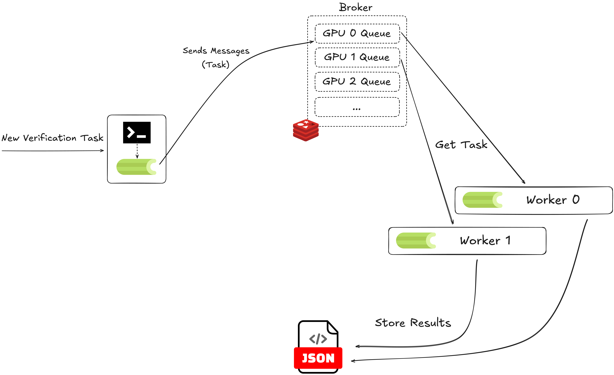

Lizard Paper Implementation
---

#### setup

- on colab, run `scripts/setup.colab` once per clone.
- on ml-institute machines, run `scripts/setup.institute` once per clone.

---

#### Benchmark / Verification setup

