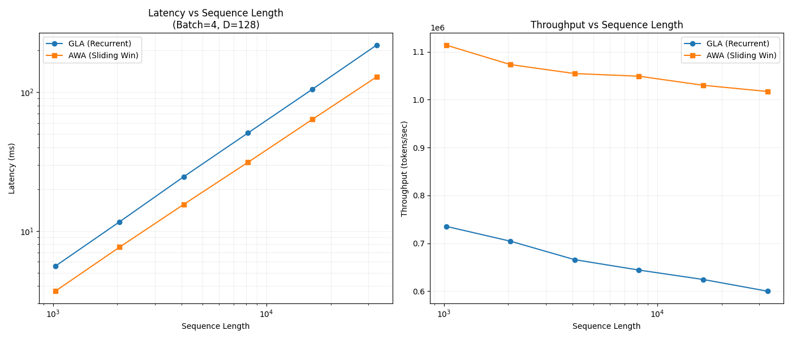
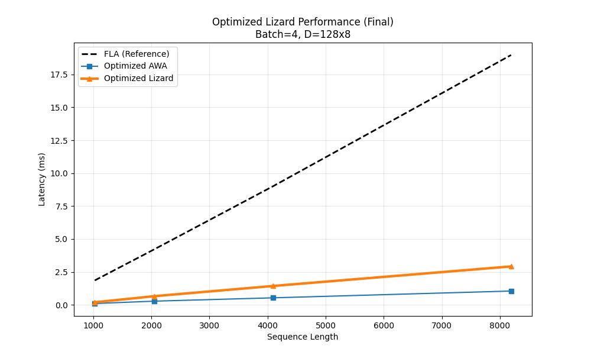

Lizard Kernels
---

### Folder Structure

```
jku-ai-practical-project/
│
├── docs/                           # Documentation and benchmark results
│   ├── GPUS.md                     # GPU specifications and details
│   ├── MODULES.md                  # Module usage instructions for different GPUs
│   ├── benchmark_results.png       # Benchmark visualization results
│   ├── benchmark_results_linear.png
│   ├── benchmark_lizard.png        # Lizard kernel benchmark results
│   ├── lizard_benchmark.png
│   ├── lizard_final_bench.png
│   ├── lizard_realistic_benchmark.png
│   ├── comparison_optimized.png    # Performance comparison charts
│   ├── comparison_optimized_v2.png
│   ├── comparison_optimized_final.png
│   ├── comparison_final.png
│   └── comparison_bf16.png
│
├── modules/                        # Core implementation modules
│   ├── awa/                        # AWA (Attention with Approximation) kernel implementations
│   │   ├── awa_gla_bench.py        # AWA-GLA benchmarking script
│   │   ├── awa_gla_gemini_bench.py # Gemini-based AWA-GLA benchmark
│   │   ├── awa_kernel_claude.py    # Claude-generated AWA kernel
│   │   ├── awa_kernel_args.py      # AWA kernel argument definitions
│   │   ├── awa_bench_plot.py       # AWA benchmark plotting
│   │   └── awa_bench_plot_no_log_space.py
│   │
│   ├── gla/                        # GLA (Gated Linear Attention) implementations
│   │   ├── __init__.py
│   │   ├── gla_fla_float16.py      # Float16 GLA-FLA implementation
│   │   ├── gla_fla_float32.py      # Float32 GLA-FLA implementation
│   │   ├── gla_fla_bfloat16.py     # BFloat16 GLA-FLA implementation
│   │   ├── gla_fla_float16_gpu_time.py
│   │   ├── gla_fla_float16_gpu_time_b_16_s_2048_h_32.py
│   │   ├── gla_fla_float32_gpu_time_b_16_s_2048_h_32.py
│   │   ├── gla_fla_float16_torch_profile.py
│   │   ├── gla_fla_float16_torch_profile_each_iter.py
│   │   ├── gla_fla_float16_torch_profile_top_cuda_kernels.py
│   │   └── gla_fla_float16_torch_profile_top_cuda_kernels_fused_recurrent.py
│   │
│   ├── lizard/                     # Lizard kernel implementations
│   │   ├── lizard_bench.py         # Main Lizard benchmark
│   │   ├── lizard_bench_2.py       # Benchmark version 2
│   │   ├── lizard_bench_3_claude.py # Claude-generated benchmark
│   │   ├── lizard_bench_4.py - lizard_bench_10.py  # Additional benchmark versions
│   │   └── lizard_correctness.py   # Correctness tests for Lizard
│   │
│   ├── local_attention/            # Local attention implementations
│   │   ├── local_attention_float32.py
│   │   └── local_attention_float32_b_16_seq_2048_h_512_w_512.py
│   │
│   ├── naive/                      # Naive/baseline implementations
│   │   ├── matmul_naive_fp16.py    # Naive FP16 matrix multiplication
│   │   ├── matmul_naive_fp16_fp8.py # FP16/FP8 matrix multiplication
│   │   ├── matmul_naive_fp16_no_benchmark.py
│   │   ├── test_triton_gtx_1080_ti.py
│   │   └── test_triton_pascal_gtx_1080_ti.py
│   │
│   ├── swa/                        # SWA (Sliding Window Attention) implementations
│   │   ├── __init__.py
│   │   ├── swa.py - swa5.py        # SWA implementation versions (swa, swa2, swa3, swa4, swa5)
│   │   ├── swa_musings.py          # Experimental SWA implementations
│   │   ├── swa_fzkuji.py
│   │   ├── swa_fzkuji_benchmark.py
│   │   ├── swa_kernel_claude.py    # Claude-generated SWA kernel
│   │   ├── swa_kernel_claude_oom.py
│   │   ├── swa_musings_naive_benchmark.py
│   │   ├── swa_musings_strided_benchmark.py
│   │   ├── swa_musings_strided_torch_compiled.py
│   │   ├── swa_musings_strided_torch_compiled_max_auto_tune.py
│   │   ├── swa_musings_strided_torch_compiled_max_auto_tune_seq_4096.py
│   │   ├── swa_musings_strided_torch_compiled_max_auto_tune_seq_8192.py
│   │   ├── swa_musings_strided_gemini_generated_triton_kernel.py
│   │   ├── swa_musings_strided_gemini_generated_triton_kernel_v2.py
│   │   ├── swa_musings_strided_gemini_generated_triton_kernel_v2_working_1.py
│   │   ├── swa_musings_strided_gemini_generated_triton_kernel_v2_working_2.py
│   │   ├── swa_musings_strided_gemini_generated_triton_kernel_v2_not_working.py
│   │   ├── swa_musings_strided_gemini_generated_triton_kernel_v2_not_working_2.py
│   │   └── swa_musings_strided_gemini_generated_triton_kernel_v2_not_working_3.py
│   │
│   └── helper.py                   # Helper utilities for modules
│
├── notebooks/                      # Jupyter notebooks for experiments
│   ├── matmul.ipynb                # Matrix multiplication experiments
│   ├── kernels.ipynb               # Kernel development notebook
│   ├── colab_local_tunnel.ipynb    # Colab local tunnel setup
│   └── profiler/                   # Profiler-related notebooks
│
├── logs/                           # Execution logs from benchmark and profiling runs
│   └── *.log files                 # Timestamped logs from various GPU benchmarks
│
├── profiles/                       # PyTorch profiler outputs (JSON format)
│   ├── gla_fla_float16_torch_profile_top_cuda_kernels.json
│   ├── gla_fla_float16_torch_profile_top_cuda_kernels_fused_recurrent.json
│   ├── swa_strided_compiled_profile_benchmark_torch_compiled.json
│   ├── swa_strided_profile_benchmark.json
│   ├── swa_naive_profile_benchmark.json
│   └── *.json files                # Additional profiling results for different configurations
│
├── fla/                            # Flash Linear Attention submodule (git submodule)
├── local-attention/                # Local Attention submodule (git submodule)
│
├── .vscode/                        # VSCode configuration
│   └── extensions.json
│
├── .githooks/                      # Git hooks
│   └── pre-commit
│
├── env.yaml                        # Conda environment specification
├── SETUP                           # Setup script for git configuration and environment
├── LICENSE.md                      # Project license
├── README.md                       # This file
├── .gitignore                      # Git ignore rules
└── .gitmodules                     # Git submodules configuration
```

#### Setup

- on ml-institute machines, run `SETUP` once per clone.
    - it setups git user with dedicated token
- on each login, `conda activate jku-ai-practical-project` should be used to activate conda environment.

##### Compatible Flash-Attention Package

```sh
pip install https://github.com/Dao-AILab/flash-attention/releases/download/v2.7.0.post2/flash_attn-2.7.0.post2+cu12torch2.5cxx11abiFALSE-cp310-cp310-linux_x86_64.whl --no-build-isolation
```

### Early Results

<details>
  <summary><strong>Benchmark: Lizard, AWA and GLA(FLA)</strong></summary>




</details>
